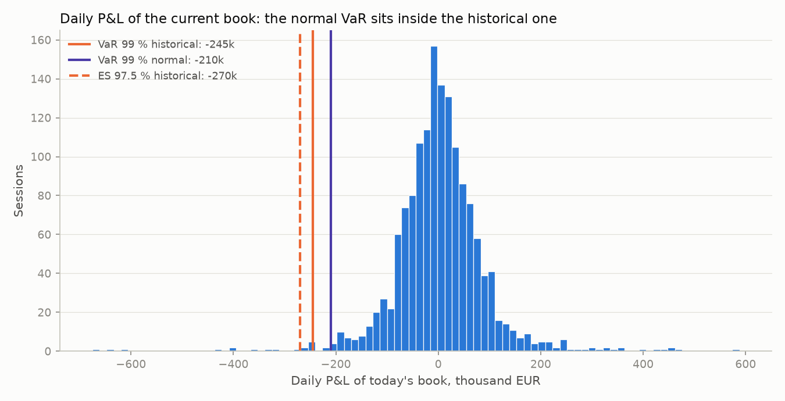
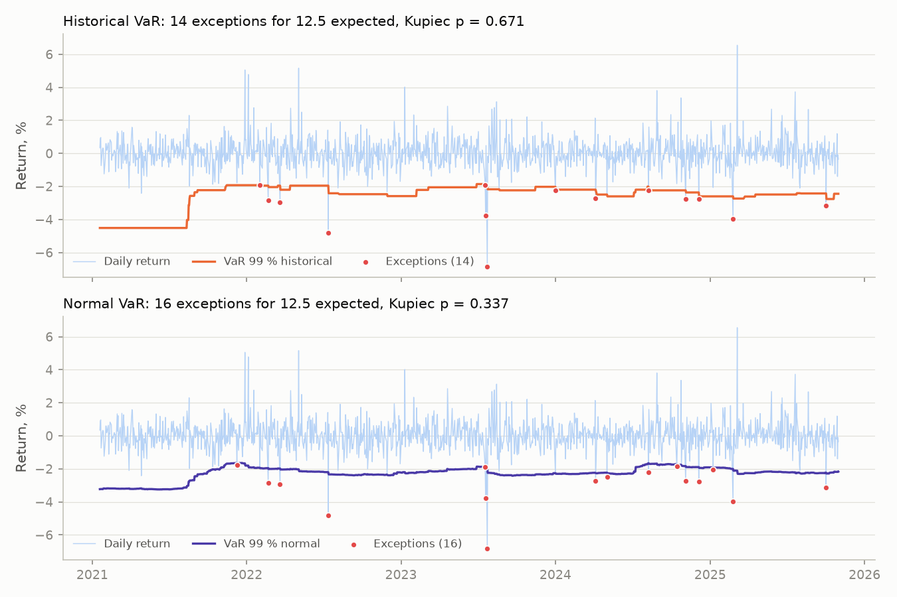

# portfolio-risk-engine

Monitoring and market risk of a multi-currency equity book valued in EUR: positions from
a trade journal, daily valuation, performance by period, VaR and Expected Shortfall,
a VaR backtest, stress tests, and an independent second implementation that must land
on the same risk figures.

Written from scratch to illustrate risk methods I use in portfolio monitoring. Contains no employer code or data.

## What it does

| Block | Module | Content |
|---|---|---|
| Positions | `journal.py` | Lots from a trade journal, weighted average cost per holding cycle, same-session rule, realised P&L, input checks |
| Valuation | `portfolio.py`, `data/fx.py` | Quantity x close x same-day FX rate; stale prices carried at most 3 sessions; chained price and total-return indices |
| Performance | `performance.py` | 1W, 1M, YTD, 1Y, since inception; market effect vs flow effect, balanced to the cent |
| Income, register | `dividends.py`, `register.py` | Gross dividends at the ex-date rate, yield on cost; per-line local return, EUR return and currency effect |
| Exposures | `exposures.py` | Concentration, sectors, currencies, geographic zones, weighted beta |
| Risk | `risk.py` | Volatility, historical and normal VaR and ES at 95 %, 97.5 %, 99 %, maximum drawdown and its duration |
| Witness | `witness/` | Independent recomputation of every risk figure from raw closes, rates and quantities |
| Backtest | `backtest.py` | Rolling 250-session 99 % VaR, Kupiec, Christoffersen, Basel traffic-light zones |
| Stress | `stress.py`, `liquidity.py`, `scenarios.toml` | Instant market shocks, worst historical week, days-to-liquidate under stressed participation |
| Benchmark | `benchmark.py` | Composite benchmark weighted like the currency exposure; beta, alpha, R squared |
| Controls | `quality.py` | Split-like price jumps, stale series, session gaps, implausible quantity changes |

## Why an independent calculation

A risk number that nobody has recomputed is an unverified number. `witness/risk_witness.py`
rebuilds the risk figures from quote-currency closes, FX rates and quantities, without
importing anything from `risk_engine`. It restates every rule on its own (same-day EUR
conversion, unit factor of metal, Monday-Friday sessions, window, minimum positions per
day, quantile interpolation) and takes other routes: a day-by-day reweighting loop where
the engine uses a matrix product, a hand-written quantile where the engine calls numpy, the
standard library's normal law where the engine calls scipy. Engine and witness must agree
within 1e-9 in relative terms; the demo and the test suite fail otherwise. A witness that
imported the checked code would share its bugs and prove nothing.

## Conventions

| Item | Convention |
|---|---|
| Reference currency | EUR. Foreign closes are converted at the same-day rate, so currency moves are part of the risk |
| Horizon | 1 day. A 10-day figure is given by square-root-of-time scaling, as an approximation |
| Confidence levels | 95 % (headline), 97.5 % and 99 % |
| Sign | VaR and ES are returns: a loss is negative (VaR 99 % = -2.72 % means a 2.72 % loss) |
| Method | Today's positions revalued on each past day (historical simulation at current composition) |
| Window | At most 10 years, ending at the valuation date |
| Quantile | Linear interpolation; ES is the mean of returns at or below the VaR |
| Missing closes | An unknown return, never a zero; a day is kept if at least max(2, n/2) positions have a return |
| Calendar | Monday to Friday; weekend quotes (metal) are left out of risk; no exchange holiday calendar |
| Volatility | Standard deviation (ddof = 1) x sqrt(252) |
| Drawdown | Largest fall of the chained index from its running peak, with peak, trough and recovery dates |
| Cash | Excluded from risk (no market risk); included in wealth, currency exposure and stress tests |

## Results on the synthetic data (seed 20240613)

`python -m risk_engine demo` values a EUR 10.1 m book (8 securities, 2 cash pockets) on
2025-10-31, over 1,498 daily returns.

| Method | Level | VaR % | ES % | VaR EUR | ES EUR |
|---|---|---|---|---|---|
| historical | 95 % | -1.360 | -2.306 | -122,188 | -207,136 |
| historical | 97.5 % | -1.956 | -3.005 | -175,669 | -269,923 |
| historical | 99 % | -2.724 | -4.248 | -244,617 | -381,565 |
| normal | 95 % | -1.642 | -2.066 | -147,446 | -185,550 |
| normal | 97.5 % | -1.962 | -2.345 | -176,181 | -210,635 |
| normal | 99 % | -2.334 | -2.678 | -209,590 | -240,491 |

Annualised volatility 16.12 %; maximum drawdown -25.36 % (peak 2020-08-25, trough
2020-09-21, recovered 2021-08-13). Witness check: OK (max rel. diff 1.7e-15).

| 99 % VaR backtest | Days | Exceptions | Expected | Kupiec p | Christoffersen p | Last 250 | Worst 250 |
|---|---|---|---|---|---|---|---|
| historical | 1,248 | 14 | 12.5 | 0.67 | 0.15 | 3 (green) | 5 (yellow) |
| normal | 1,248 | 16 | 12.5 | 0.34 | 0.20 | 4 (green) | 8 (yellow) |

On this one draw the difference is modest. `python -m risk_engine seeds` repeats the
backtest on 30 synthetic histories: the normal VaR averages 17.3 exceptions for 12.5
expected and Kupiec rejects it in 10 of 30 cases, against 15.3 exceptions and no rejection
for the historical VaR. On fat-tailed returns the normal law places the 99 % quantile too
close to the centre, and its ES understates the tail even more (-2.68 % against -4.25 %).
In `--live` mode on real closes (run in September 2026) both methods were rejected and
exceptions clustered (Christoffersen p below 0.001): an unconditional VaR reacts too
slowly to volatility regimes.

| Stress (share of wealth) | Loss |
|---|---|
| Equities -20 % | -15.60 % |
| USD -10 % against EUR (HKD pegged) | -5.89 % |
| Asia -25 % | -6.45 % |
| Gold +15 % | +1.69 % |
| Worst 5 sessions of the sample | -16.38 % |
| Liquidity: days to sell at 20 % / 10 % / 5 % of volume | 0.04 / 0.07 / 0.15 |





## Installation

```bash
python -m venv .venv
.venv/bin/pip install -e ".[dev]"          # add ,live for the Yahoo mode
python -m risk_engine demo                 # synthetic data, writes docs/img/*.png
python -m risk_engine demo --live          # Yahoo closes, cached in .cache/ (not committed)
python -m risk_engine seeds --n 30         # backtest over 30 synthetic histories
pytest && ruff check .
```

Python 3.11 or later; numpy, pandas, scipy, matplotlib; yfinance only for `--live`.

## Limits

- **Historical window.** The VaR only knows the last ten years of this composition; a regime
  absent from the window is absent from the figure, and today's weights are applied to
  the whole past (the book was not held this way throughout).
- **Normal assumption.** The parametric VaR and ES assume normal returns; with fat tails
  they understate the loss, as the backtest shows.
- **No liquidity risk in VaR.** Positions are assumed sold at the close. The liquidity
  stress is a sensitivity on a participation rate, not a liquidity-adjusted VaR.
- **Square root of time.** The 10-day scaling assumes independent, identically distributed
  returns and a static book; clustering and autocorrelation make it wrong in stress.
- **Synthetic data.** Prices, volumes, dividends and betas are simulated
  (multivariate Student-t, 4 degrees of freedom, two stressed regimes, a few crisis days).
  The securities are real names used as labels only. Results say nothing about them.
- **Calendar.** No exchange holiday calendar: a closure longer than three sessions takes a
  line out of the valuation total, which is then flagged as incomplete.

Details of every formula and test: [docs/METHODOLOGY.md](docs/METHODOLOGY.md).

License: MIT.
