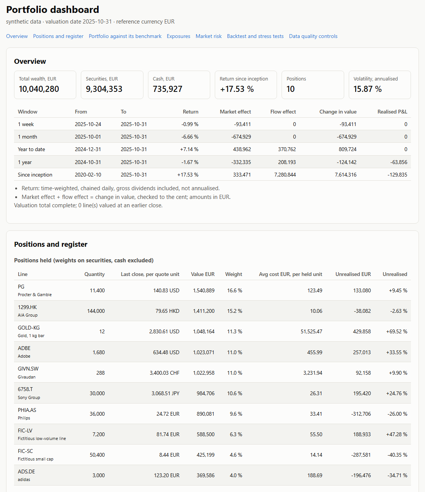

# portfolio-risk-engine

Portfolio monitoring and market risk for a multi-currency equity book valued in EUR. On the
monitoring side it covers positions rebuilt from a trade journal, daily valuation,
performance by period split into market and flow effects, a position register,
dividends, exposures and a benchmark. On the risk side it covers VaR and Expected
Shortfall, a VaR backtest, market and liquidity stress tests, and an independent second
implementation that must land on the same risk figures.

Written from scratch to illustrate risk methods I use in portfolio monitoring. Contains no employer code or data.



*Top of the HTML dashboard written by `python -m risk_engine demo --html`
(`docs/dashboard.html`, a single self-contained file that works offline; GitHub shows its
source, so download it or open it locally).*

## Highlights

- **Independent witness:** a second implementation that imports nothing from the engine lands on the same risk figures to about 1e-15.
- **VaR backtest:** over 30 synthetic histories Kupiec rejects the normal VaR 6 times against 1 for the historical VaR; on real closes both are rejected, with clustered exceptions.
- **Liquidity stress:** the value-weighted score says 3 days to sell at 5 % of volume, while the least liquid line needs 26 days.

---

# Part 1: Portfolio monitoring

## What it covers

| Block | Module | Content |
|---|---|---|
| Positions | `journal.py` | Lots from a trade journal, weighted average cost per holding cycle, same-session rule, realised P&L, input checks |
| Valuation | `portfolio.py`, `data/fx.py` | Quantity x close x same-day FX rate; stale prices carried at most 3 sessions; chained price and total-return indices |
| Performance | `performance.py` | 1W, 1M, YTD, 1Y, since inception; market effect vs flow effect, balanced to the cent |
| Income, register | `dividends.py`, `register.py` | Gross dividends at the ex-date rate, yield on cost; per-line local return, EUR return and currency effect |
| Exposures | `exposures.py` | Concentration, sectors, currencies, geographic zones, weighted beta |
| Benchmark | `benchmark.py` | Composite benchmark weighted like the currency exposure; beta, alpha, R squared, tracking error |
| Controls | `quality.py` | Split-like price jumps, stale series, session gaps, implausible quantity changes |
| Dashboard | `dashboard.py` | One self-contained HTML page: overview, positions, register, benchmark, exposures, risk, stress, controls |

## Conventions

| Item | Convention |
|---|---|
| Cost basis | Weighted average cost per holding cycle; a cycle ends when the quantity returns to zero |
| Same session | A session's sales draw first on the holding before the session, then on that day's purchases |
| Currency | EUR; each trade at its own date's rate, each close at the same-day rate |
| Stale prices | A close is carried at most 3 Monday-Friday sessions; beyond that the line leaves the total, which is flagged |
| Return | Time-weighted, chained daily on the positions held the day before, gross dividends included, not annualised |
| Market and flow | Change in value = market effect (price and FX on what was held) + flow effect (purchases - sales), to the cent |
| Dividends | Gross, on the ex-date; entitled quantity = holding at the close before the ex-date |
| Currency effect | (1 + EUR return) / (1 + local return) - 1, so the product identity holds exactly |

## Results on the synthetic data (seed 20240613)

`python -m risk_engine demo` values a EUR 10.0 m book on 2025-10-31: eight listed names,
two fictitious illiquid lines (a small cap and a thinly traded stock, 10 % of the total)
and two cash pockets. The journal has 25 trades since February 2020, including a
position sold out and rebought, a same-session sale and purchase, and a line closed.

| Window | From | Return | Market effect EUR | Flow effect EUR |
|---|---|---|---|---|
| 1 week | 2025-10-24 | -0.99 % | -93,411 | 0 |
| 1 month | 2025-10-01 | -6.66 % | -674,929 | 0 |
| Year to date | 2024-12-31 | +7.14 % | 438,962 | 370,762 |
| 1 year | 2024-10-31 | -1.67 % | -332,335 | 208,193 |
| Since inception | 2020-02-10 | +17.53 % | 333,471 | 7,280,844 |

Since inception the book gained EUR 333,471 on markets, while EUR 7.28 m of net purchases
account for the rest of the change in value; realised P&L is EUR -129,835.

| Register, whole life of the line | State | Local return | EUR return | Currency effect |
|---|---|---|---|---|
| Sony Group (JPY) | sold out, rebought | -0.58 % | +19.57 % | +20.27 % |
| Gold, 1 kg bar (USD) | held | +58.12 % | +69.52 % | +7.21 % |
| Procter & Gamble (USD) | held | +17.26 % | +23.32 % | +5.16 % |
| Kone (EUR) | exited | -0.76 % | -0.76 % | 0.00 % |

Exposures, as a share of wealth: USD 28.9 %, EUR 26.6 %, HKD 14.1 %, gold 10.4 %,
CHF 10.2 %, JPY 9.8 %; by zone, eurozone 37.1 %, North America 28.9 %, Greater China
14.1 %. The largest line weighs 16.6 % of securities and cash 7.3 % of wealth.

Against a composite benchmark weighted like the currency exposure (Europe 35 %, US 28 %,
Asia ex-Japan 15 %, gold 11 %, Japan 11 %), both total return over 1,494 sessions:
beta 0.90, alpha +0.50 % a year, R squared 0.79, tracking error 7.63 %.

---

# Part 2: Market risk

## What it covers

| Block | Module | Content |
|---|---|---|
| Risk | `risk.py` | Volatility, historical and normal VaR and ES at 95 %, 97.5 %, 99 %, maximum drawdown and its duration |
| Witness | `witness/` | Independent recomputation of every risk figure from raw closes, rates and quantities |
| Backtest | `backtest.py` | Rolling 250-session 99 % VaR, Kupiec, Christoffersen, Basel traffic-light zones |
| Stress | `stress.py`, `liquidity.py`, `scenarios.toml` | Instant market shocks, worst historical week, days-to-liquidate under stressed participation |

## Why an independent calculation

A risk number that nobody has recomputed is an unverified number. `witness/risk_witness.py`
rebuilds the risk figures from quote-currency closes, FX rates and quantities, without
importing anything from `risk_engine`. It restates every rule on its own (same-day EUR
conversion, unit factor of metal, Monday-Friday sessions, window, minimum positions per
day, quantile interpolation) and takes other routes: a day-by-day reweighting loop where
the engine uses a matrix product, a hand-written quantile where the engine calls numpy, the
standard library's normal law where the engine calls scipy. Engine and witness must agree
within 1e-9 in relative terms; the demo and the test suite fail otherwise. A witness that
imported the checked code would share its bugs and prove nothing.

## Conventions

| Item | Convention |
|---|---|
| Reference currency | EUR. Foreign closes are converted at the same-day rate, so currency moves are part of the risk |
| Horizon | 1 day. A 10-day figure is given by square-root-of-time scaling, as an approximation |
| Confidence levels | 95 % (headline), 97.5 % and 99 % |
| Sign | VaR and ES are returns: a loss is negative (VaR 99 % = -2.64 % means a 2.64 % loss) |
| Method | Today's positions revalued on each past day (historical simulation at current composition) |
| Window | At most 10 years, ending at the valuation date |
| Quantile | Linear interpolation; ES is the mean of returns at or below the VaR |
| Missing closes | An unknown return, never a zero; a day is kept if at least max(2, n/2) positions have a return |
| Calendar | Monday to Friday; weekend quotes (metal) are left out of risk; no exchange holiday calendar |
| Volatility | Standard deviation (ddof = 1) x sqrt(252) |
| Drawdown | Largest fall of the chained index from its running peak, with peak, trough and recovery dates |
| Cash | Excluded from risk (no market risk); included in wealth, currency exposure and stress tests |

## Results on the synthetic data

Over 1,495 daily returns:

| Method | Level | VaR % | ES % | VaR EUR | ES EUR |
|---|---|---|---|---|---|
| historical | 95 % | -1.318 | -2.261 | -122,653 | -210,387 |
| historical | 97.5 % | -1.865 | -2.958 | -173,498 | -275,246 |
| historical | 99 % | -2.643 | -4.188 | -245,927 | -389,683 |
| normal | 95 % | -1.617 | -2.035 | -150,476 | -189,341 |
| normal | 97.5 % | -1.932 | -2.310 | -179,784 | -214,926 |
| normal | 99 % | -2.299 | -2.637 | -213,861 | -245,379 |

Annualised volatility 15.87 %; maximum drawdown -25.60 % (peak 2020-08-25, trough
2020-09-21, recovered 2021-08-17). Witness check: OK (max rel. diff 1.5e-15).

| 99 % VaR backtest | Days | Exceptions | Expected | Kupiec p | Christoffersen p | Last 250 | Worst 250 |
|---|---|---|---|---|---|---|---|
| historical | 1,245 | 15 | 12.5 | 0.48 | 0.55 | 3 (green) | 6 (yellow) |
| normal | 1,245 | 18 | 12.5 | 0.14 | 0.47 | 4 (green) | 8 (yellow) |

On one draw the difference is modest. `python -m risk_engine seeds` repeats the backtest
on 30 synthetic histories: the normal VaR averages 16.9 exceptions for 12.4 expected and
Kupiec rejects it in 6 of 30 cases, against 15.6 exceptions and 1 rejection for the
historical VaR. On fat-tailed returns the normal law places the 99 % quantile too close
to the centre, and its ES understates the tail even more (-2.64 % against -4.19 %).
In `--live` mode on real closes (run in September 2026) both methods were rejected and
exceptions clustered (Christoffersen p below 0.001): an unconditional VaR reacts too
slowly to volatility regimes.

| Stress (share of wealth) | Loss |
|---|---|
| Equities -20 % | -16.45 % |
| USD -10 % against EUR (HKD pegged) | -5.34 % |
| Asia -25 % | -5.97 % |
| Gold +15 % | +1.57 % |
| Worst 5 sessions of the sample | -16.96 % |

| Liquidity stress: days to sell | Weight | 20 % of volume | 10 % | 5 % |
|---|---|---|---|---|
| Fictitious low-volume line | 6.3 % | 6.60 | 13.21 | 26.42 |
| Fictitious small cap | 4.6 % | 4.74 | 9.49 | 18.98 |
| Most illiquid listed name | 11.0 % | 0.10 | 0.19 | 0.39 |
| Book, value-weighted (88.7 % covered; the metal has no volume) | | 0.75 | 1.49 | 2.98 |

Two lines holding a tenth of the book account for about 95 % of the value-weighted score,
and the score hides the tail: at a 5 % participation rate the last line would take 26
sessions, more than five weeks, to sell.


---

## Installation

```bash
python -m venv .venv
.venv/bin/pip install -e ".[dev]"          # Linux, macOS; add ,live for the Yahoo mode
.venv\Scripts\pip install -e ".[dev]"      # Windows
python -m risk_engine demo                 # synthetic data, writes docs/img/*.png
python -m risk_engine demo --html          # also writes the dashboard, docs/dashboard.html
python -m risk_engine demo --live          # Yahoo closes, cached in .cache/ (not committed)
python -m risk_engine seeds --n 30         # backtest over 30 synthetic histories
pytest && ruff check .
```

Python 3.11 or later; numpy, pandas, scipy, matplotlib; yfinance only for `--live`.

## Limits

- **Performance.** Returns are time-weighted and never annualised; they say how the
  positions did, not how well cash flows were timed (no money-weighted return).
- **Corporate actions.** Splits must be restated in the journal (a guard flags trades that
  look unrestated); spin-offs are not neutralised in the chained index.
- **Dividends.** Gross, without withholding tax; the benchmark trackers follow net indices,
  a bias the dashboard shows as a band rather than corrects.
- **Historical window.** The VaR only knows the last ten years of this composition; a regime
  absent from the window is absent from the figure, and today's weights are applied to
  the whole past (the book was not held this way throughout).
- **Normal assumption.** The parametric VaR and ES assume normal returns; with fat tails
  they understate the loss, as the backtest shows.
- **No liquidity risk in VaR.** Positions are assumed sold at the close. The liquidity
  stress is a sensitivity on a participation rate, not a liquidity-adjusted VaR.
- **Square root of time.** The 10-day scaling assumes independent, identically distributed
  returns and a static book; clustering and autocorrelation make it wrong in stress.
- **Synthetic data.** Prices, volumes, dividends and betas are simulated
  (multivariate Student-t, 4 degrees of freedom, two stressed regimes, a few crisis days).
  The listed securities are real names used as labels only, and the two illiquid lines
  are invented. Results say nothing about any company.
- **Calendar.** No exchange holiday calendar: a closure longer than three sessions takes a
  line out of the valuation total, which is then flagged as incomplete.

Details of every formula and test: [docs/METHODOLOGY.md](docs/METHODOLOGY.md).

License: MIT.
